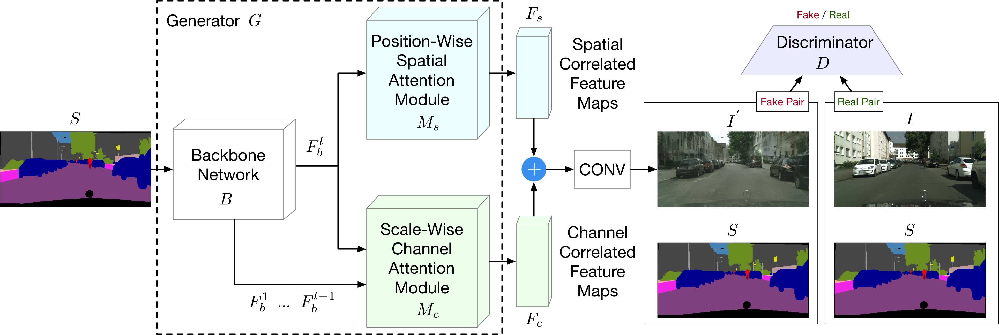
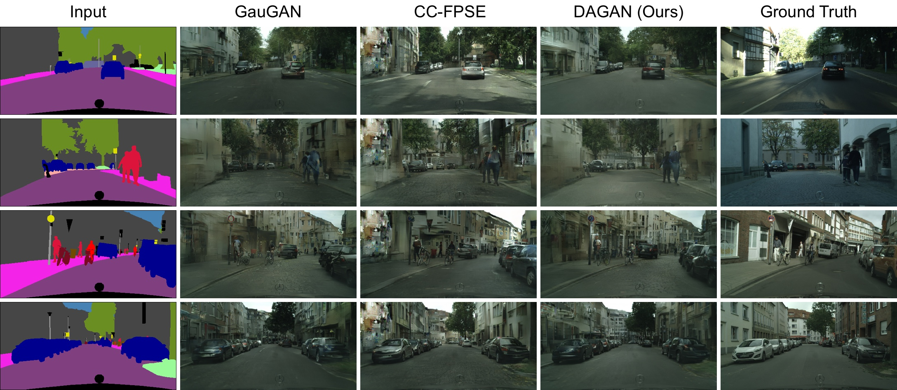
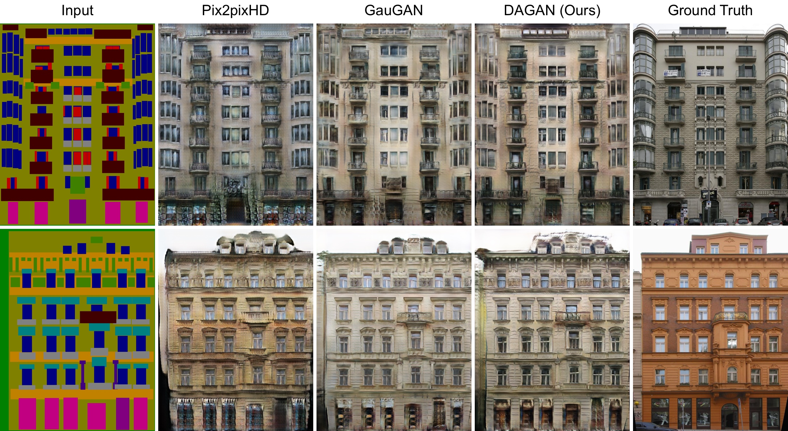
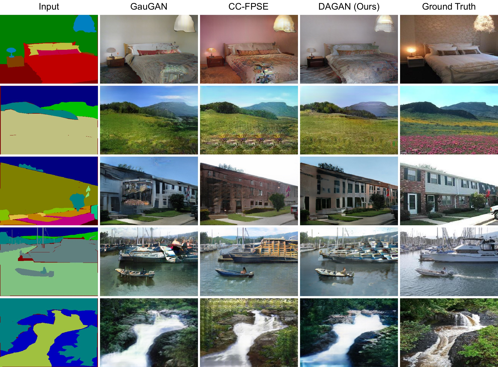
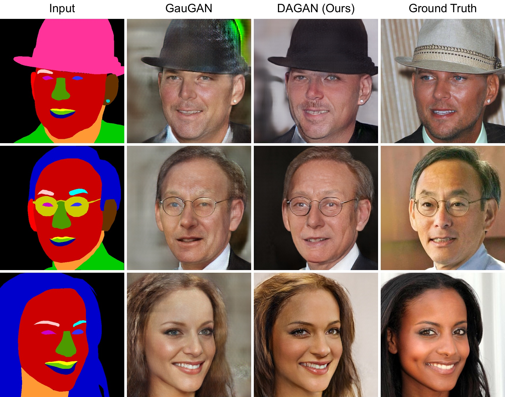
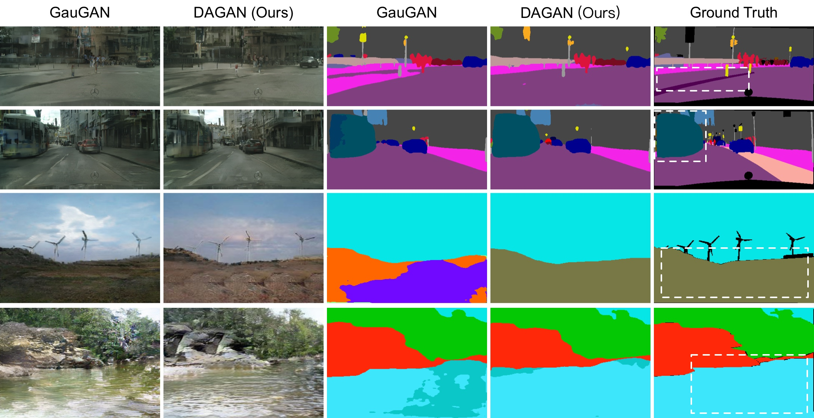

[](https://github.com/Ha0Tang/DAGAN/blob/master/LICENSE.md)


[]((https://github.com/Ha0Tang/DAGAN/graphs/commit-activity))


## Contents
  - [Semantic Image Synthesis with DAGAN](#Semantic-Image-Synthesis-with-DAGAN)
  - [Installation](#Installation)
  - [Dataset Preparation](#Dataset-Preparation)
  - [Generating Images Using Pretrained Model](#Generating-Images-Using-Pretrained-Model)
  - [Train and Test New Models](#Train-and-Test-New-Models)
  - [Evaluation](#Evaluation)
  - [Acknowledgments](#Acknowledgments)
  - [Related Projects](#Related-Projects)
  - [Citation](#Citation)
  - [Contributions](#Contributions)
  - [Collaborations](#Collaborations)

## Semantic Image Synthesis with DAGAN

**[Dual Attention GANs for Semantic Image Synthesis](https://arxiv.org/abs/2008.13024)**  
[Hao Tang](http://disi.unitn.it/~hao.tang/)<sup>1</sup>, [Song Bai](http://songbai.site/)<sup>2</sup>, [Nicu Sebe](https://scholar.google.com/citations?user=stFCYOAAAAAJ&hl=en)<sup>13</sup>. <br> 
<sup>1</sup>University of Trento, Italy, <sup>2</sup>University of Oxford, UK, <sup>3</sup>Huawei Research Ireland, Ireland. <br>
In [ACM MM 2020](https://2020.acmmm.org/). <br>
The repository offers the official implementation of our paper in PyTorch.

In the meantime, check out our related CVPR 2020 paper [Local Class-Specific and Global Image-Level Generative Adversarial Networks for Semantic-Guided Scene Generation](https://github.com/Ha0Tang/LGGAN) and Arxiv paper [Edge Guided GANs with Semantic Preserving for Semantic Image Synthesis](https://github.com/Ha0Tang/EdgeGAN).

### Framework


### Results of Generated Images

#### Cityscapes (512×256)


#### Facades (1024×1024)


#### ADE20K (256×256)


#### CelebAMask-HQ (512×512)


### Results of Generated Segmenation Maps



### [License](./LICENSE.md)
<a rel="license" href="http://creativecommons.org/licenses/by-nc-sa/4.0/"></a><br />
Copyright (C) 2020 University of Trento, Italy.

All rights reserved.
Licensed under the [CC BY-NC-SA 4.0](https://creativecommons.org/licenses/by-nc-sa/4.0/legalcode) (**Attribution-NonCommercial-ShareAlike 4.0 International**)

The code is released for academic research use only. For commercial use, please contact [hao.tang@unitn.it](hao.tang@unitn.it).

## Installation

Clone this repo.
```bash
git clone https://github.com/Ha0Tang/DAGAN
cd DAGAN/
```

This code requires PyTorch 1.0 and python 3+. Please install dependencies by
```bash
pip install -r requirements.txt
```

This code also requires the Synchronized-BatchNorm-PyTorch rep.
```
cd DAGAN_v1/
cd models/networks/
git clone https://github.com/vacancy/Synchronized-BatchNorm-PyTorch
cp -rf Synchronized-BatchNorm-PyTorch/sync_batchnorm .
cd ../../
```

To reproduce the results reported in the paper, you would need an NVIDIA DGX1 machine with 8 V100 GPUs.

## Dataset Preparation
Please download the datasets on the respective webpages. 
- Facades: 55.8M, [here](http://cmp.felk.cvut.cz/~tylecr1/facade/).
- DeepFashion: 592.3M, [here](http://mmlab.ie.cuhk.edu.hk/projects/DeepFashion.html).
- CelebAMask-HQ: 2.7G, [here](https://github.com/switchablenorms/CelebAMask-HQ).
- Cityscapes: 8.4G, [here](https://www.cityscapes-dataset.com/).
- ADE20K: 953.7M, [here](http://data.csail.mit.edu/places/ADEchallenge/ADEChallengeData2016.zip).
- COCO-Stuff: 21.5G, [here](https://github.com/nightrome/cocostuff).

We also provide the prepared datasets for your convience.
```
sh datasets/download_dagan_dataset.sh [dataset]
```
where `[dataset]` can be one of `facades`, `deepfashion`, `celeba`, `cityscapes`, `ade20k`, or `coco_stuff`.

## Generating Images Using Pretrained Model
1. Download the pretrained models using the following script,
```
sh scripts/download_dagan_model.sh GauGAN_DAGAN_[dataset]
```
where `[dataset]` can be one of `cityscapes`, `ade`, `facades`, or `celeba`.

2. Change several parameter and then generate images using `test_[dataset].sh`. If you are running on CPU mode, append `--gpu_ids -1`.
3. The outputs images are stored at `./results/[type]_pretrained/` by default. You can view them using the autogenerated HTML file in the directory.

## Train and Test New Models
1. Prepare dataset.
2. Change several parameters and then run `train_[dataset].sh` for training.
There are many options you can specify. To specify the number of GPUs to utilize, use `--gpu_ids`. If you want to use the second and third GPUs for example, use `--gpu_ids 1,2`.
3. Testing is similar to testing pretrained models. Use `--results_dir` to specify the output directory. `--how_many` will specify the maximum number of images to generate. By default, it loads the latest checkpoint. It can be changed using `--which_epoch`.

## Evaluation
- FID: [mseitzer/pytorch-fid](https://github.com/mseitzer/pytorch-fid)
- FRD: [Ha0Tang/GestureGAN](https://github.com/Ha0Tang/GestureGAN/tree/master/scripts/evaluation/FRD)
- LPIPS: [richzhang/PerceptualSimilarity](https://github.com/richzhang/PerceptualSimilarity)
- DRN: [fyu/drn](https://github.com/fyu/drn) [model: drn-d-105_ms_cityscapes.pth]
- UperNet: [CSAILVision/semantic-segmentation-pytorch](https://github.com/CSAILVision/semantic-segmentation-pytorch) [model: baseline-resnet101-upernet]
- DeepLab: [kazuto1011/deeplab-pytorch](https://github.com/kazuto1011/deeplab-pytorch) [model: deeplabv2_resnet101_msc-cocostuff164k-100000.pth]

For more details, please refer to [this issue](https://github.com/NVlabs/SPADE/issues/39).

## Acknowledgments
This source code is inspired by both [GauGAN/SPADE](https://github.com/NVlabs/SPADE) and [LGGAN](https://github.com/Ha0Tang/LGGAN).

## Related Projects
**[EdgeGAN](https://github.com/Ha0Tang/EdgeGAN) | [LGGAN](https://github.com/Ha0Tang/LGGAN) | [SelectionGAN](https://github.com/Ha0Tang/SelectionGAN) | [PanoGAN](https://github.com/sswuai/PanoGAN) | [Guided-I2I-Translation-Papers](https://github.com/Ha0Tang/Guided-I2I-Translation-Papers)**

## Citation
If you use this code for your research, please consider giving stars :star: and citing our papers :t-rex::

DAGAN
```
@inproceedings{tang2020dual,
  title={Dual Attention GANs for Semantic Image Synthesis},
  author={Tang, Hao and Bai, Song and Sebe, Nicu},
  booktitle ={ACM MM},
  year={2020}
}
```

EdgeGAN
```
@article{tang2020edge,
  title={Edge Guided GANs with Semantic Preserving for Semantic Image Synthesis},
  author={Tang, Hao and Qi, Xiaojuan and Xu, Dan and Torr, Philip HS and Sebe, Nicu},
  journal={arXiv preprint arXiv:2003.13898},
  year={2020}
}
```

LGGAN
```
@inproceedings{tang2019local,
  title={Local Class-Specific and Global Image-Level Generative Adversarial Networks for Semantic-Guided Scene Generation},
  author={Tang, Hao and Xu, Dan and Yan, Yan and Torr, Philip HS and Sebe, Nicu},
  booktitle={CVPR},
  year={2020}
}
```

SelectionGAN
```
@inproceedings{tang2019multi,
  title={Multi-channel attention selection gan with cascaded semantic guidance for cross-view image translation},
  author={Tang, Hao and Xu, Dan and Sebe, Nicu and Wang, Yanzhi and Corso, Jason J and Yan, Yan},
  booktitle={CVPR},
  year={2019}
}

@article{tang2020multi,
  title={Multi-channel attention selection gans for guided image-to-image translation},
  author={Tang, Hao and Xu, Dan and Yan, Yan and Corso, Jason J and Torr, Philip HS and Sebe, Nicu},
  journal={arXiv preprint arXiv:2002.01048},
  year={2020}
}
```

## Contributions
If you have any questions/comments/bug reports, feel free to open a github issue or pull a request or e-mail to the author Hao Tang ([hao.tang@unitn.it](hao.tang@unitn.it)).

## Collaborations
I'm always interested in meeting new people and hearing about potential collaborations. If you'd like to work together or get in contact with me, please email hao.tang@unitn.it.
___
*Take a few minutes to appreciate what you have and how far you've come.*